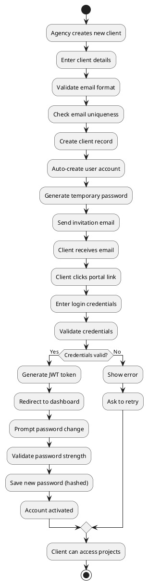
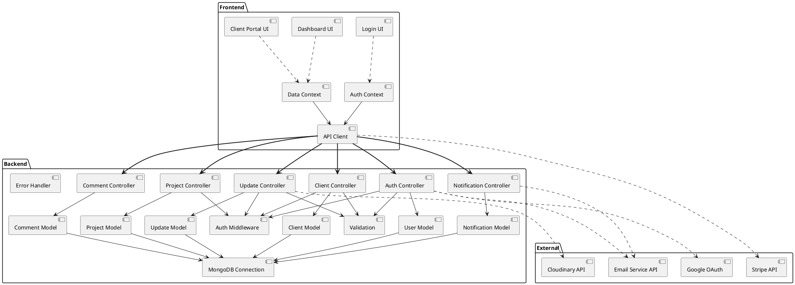
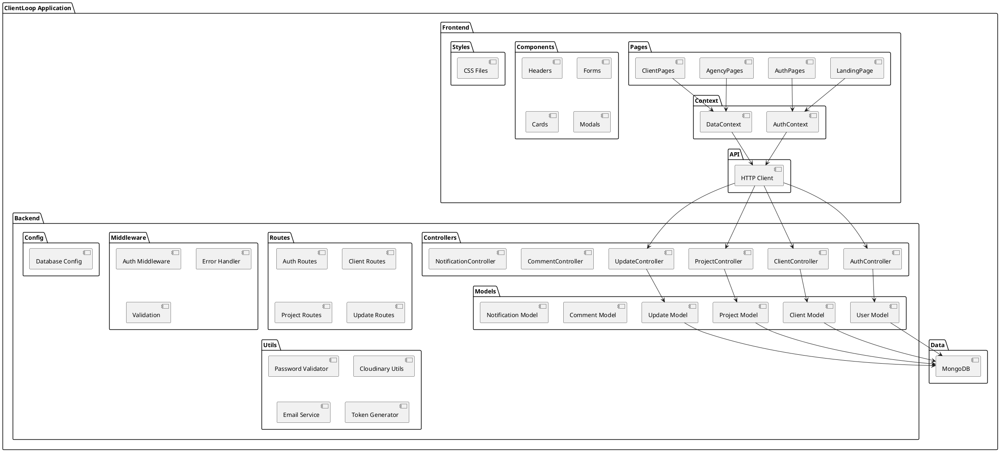

# UML DIAGRAMS - PLANTUML CODE

Use this code with PlantUML (https://www.plantuml.com/plantuml/uml/) to generate diagrams

---

## 1. CLASS DIAGRAM - PlantUML Code

```plantuml
@startuml ClientLoop_ClassDiagram
!define ABSTRACT abstract

package "ClientLoop System" {
    
    class User {
        -_id: ObjectId
        -name: String
        -email: String
        -password: String (hashed)
        -role: Enum[agency, client]
        -clientId: ObjectId
        -company: String
        -plan: Enum[free, starter, agency]
        -avatar: String
        -googleId: String
        -createdAt: Date
        -updatedAt: Date
        --
        +register(): Promise
        +login(): Promise
        +updateProfile(): Promise
        +changePassword(): Promise
        +logout(): void
        +validatePassword(): Boolean
    }
    
    class Client {
        -_id: ObjectId
        -name: String
        -email: String
        -contactName: String
        -phone: String
        -company: String
        -industry: String
        -status: Enum[active, inactive]
        -agencyId: ObjectId
        -userId: ObjectId
        -createdAt: Date
        -updatedAt: Date
        --
        +create(): Promise
        +update(): Promise
        +delete(): Promise
        +getProjects(): Array
        +getStatus(): String
    }
    
    class Project {
        -_id: ObjectId
        -name: String
        -description: String
        -status: Enum[not-started, in-progress, waiting-approval, completed]
        -clientId: ObjectId
        -agencyId: ObjectId
        -clientName: String
        -createdAt: Date
        -updatedAt: Date
        --
        +create(): Promise
        +update(): Promise
        +delete(): Promise
        +getUpdates(): Array
        +getStatus(): String
        +getStats(): Object
    }
    
    class Update {
        -_id: ObjectId
        -title: String
        -content: String
        -type: Enum[progress, milestone, delivery]
        -projectId: ObjectId
        -agencyId: ObjectId
        -author: String
        -requiresApproval: Boolean
        -approvalStatus: Enum[none, pending, approved, changes-requested]
        -approvedBy: String
        -approvedAt: Date
        -changeRequestedBy: String
        -changeRequestedAt: Date
        -changeRequestNote: String
        -files: Array[File]
        -createdAt: Date
        -updatedAt: Date
        --
        +create(): Promise
        +update(): Promise
        +delete(): Promise
        +approve(): Promise
        +requestChanges(): Promise
        +attachFile(): Promise
    }
    
    class Comment {
        -_id: ObjectId
        -content: String
        -updateId: ObjectId
        -authorId: ObjectId
        -authorName: String
        -authorRole: Enum[agency, client]
        -createdAt: Date
        -updatedAt: Date
        --
        +create(): Promise
        +update(): Promise
        +delete(): Promise
        +getAuthor(): String
    }
    
    class Notification {
        -_id: ObjectId
        -userId: ObjectId
        -type: String
        -message: String
        -isRead: Boolean
        -relatedId: ObjectId
        -createdAt: Date
        -updatedAt: Date
        --
        +create(): Promise
        +markAsRead(): Promise
        +delete(): Promise
        +sendEmail(): Promise
    }
    
    class File {
        -name: String
        -url: String
        -size: String
        -sizeBytes: Number
        -type: String
        -publicId: String
        -uploadedAt: Date
    }
    
    ' Relationships
    User "1" -- "many" Client : creates
    User "1" -- "many" Project : creates
    User "1" -- "many" Update : posts
    User "1" -- "many" Comment : writes
    User "1" -- "many" Notification : receives
    Client "1" -- "many" Project : has
    Project "1" -- "many" Update : contains
    Update "1" -- "many" Comment : receives
    Update "1" -- "many" File : has
}

@enduml
```



---

## 2. USE CASE DIAGRAM - PlantUML Code

```plantuml
@startuml ClientLoop_UseCaseDiagram
left to right direction

package "ClientLoop System" {
    
    ' Actors
    actor AgencyUser as agency
    actor ClientUser as client
    actor System as system
    
    ' Common Use Cases
    usecase "Register / Login" as UC_Auth
    usecase "Manage Profile & Settings" as UC_Profile
    usecase "View Notifications" as UC_Notifications
    usecase "Change Password / Logout" as UC_Security
    
    ' Agency Use Cases
    usecase "Create Client" as UC_CreateClient
    usecase "Edit Client Info" as UC_EditClient
    usecase "Manage Clients" as UC_ManageClients
    usecase "Create Project" as UC_CreateProject
    usecase "Edit Project Details" as UC_EditProject
    usecase "View Project Status" as UC_ViewProjectStatus
    usecase "Post Update with Files" as UC_PostUpdate
    usecase "Request Client Approval" as UC_RequestApproval
    usecase "View Client Comments" as UC_ViewComments
    usecase "Manage Billing" as UC_Billing
    usecase "View Analytics" as UC_Analytics
    usecase "Download Invoices" as UC_Invoices
    
    ' Client Use Cases
    usecase "View Project Updates" as UC_ViewUpdates
    usecase "Download Files" as UC_DownloadFiles
    usecase "Leave Comments" as UC_LeaveComments
    usecase "Approve Updates" as UC_ApproveUpdates
    usecase "Request Changes" as UC_RequestChanges
    usecase "Receive Notifications" as UC_ReceiveNotif
    
    ' System Use Cases
    usecase "Send Email Notifications" as UC_EmailNotif
    usecase "Process Payments (Stripe)" as UC_Payments
    usecase "Generate Analytics" as UC_GenAnalytics
    
    ' Relationships
    agency --> UC_Auth
    client --> UC_Auth
    
    agency --> UC_Profile
    client --> UC_Profile
    
    agency --> UC_Notifications
    client --> UC_Notifications
    
    agency --> UC_Security
    client --> UC_Security
    
    ' Agency exclusive
    agency --> UC_CreateClient
    agency --> UC_EditClient
    agency --> UC_ManageClients
    agency --> UC_CreateProject
    agency --> UC_EditProject
    agency --> UC_ViewProjectStatus
    agency --> UC_PostUpdate
    agency --> UC_RequestApproval
    agency --> UC_ViewComments
    agency --> UC_Billing
    agency --> UC_Analytics
    agency --> UC_Invoices
    
    ' Client exclusive
    client --> UC_ViewUpdates
    client --> UC_DownloadFiles
    client --> UC_LeaveComments
    client --> UC_ApproveUpdates
    client --> UC_RequestChanges
    client --> UC_ReceiveNotif
    
    ' System use cases
    system --> UC_EmailNotif
    system --> UC_Payments
    system --> UC_GenAnalytics
}

@enduml
```



---

## 3. ACTIVITY DIAGRAM - Update Approval - PlantUML Code

```plantuml
@startuml ClientLoop_Activity_UpdateApproval
start
:Agency posts update;
:Validate update input;
:Upload files to Cloudinary;
:Save to database;
if (Requires approval?) then (Yes)
    :Set status: pending;
    :Send notification to client;
    :Wait for client response;
    if (Client response) then (Approved)
        :Update status: approved;
        :Record approval timestamp;
        :Notify agency;
    else (Request Changes)
        :Update status: changes-requested;
        :Store change notes;
        :Notify agency;
    else (No response - timeout)
        :Keep status: pending;
    endif
else (No)
    :Update posted immediately;
endif
:Send notification;
stop
@enduml
```

---

## 4. ACTIVITY DIAGRAM - Client Registration - PlantUML Code



---

## 5. DEPLOYMENT DIAGRAM - PlantUML Code

```plantuml
@startuml ClientLoop_Deployment
!define CLOUD_RECT rectangle

node "Client Devices" as client_node {
    component "Web Browser" as browser {
        component "React App (Vite)" as frontend
    }
}

node "Cloud Hosting (AWS/GCP/Azure)" as cloud {
    component "Load Balancer" as lb
    component "Reverse Proxy\n(Nginx)" as proxy
    component "Express Server\n:5000" as server
    component "MongoDB Database" as db
}

node "External Services" as external {
    component "Cloudinary\n(File Storage)" as cloudinary
    component "Stripe\n(Payments)" as stripe
    component "Email Service\n(Mailgun)" as email
    component "Google OAuth\n(Auth)" as oauth
}

frontend --|> browser
browser -.HTTPS.-> lb
lb --> proxy
proxy --> server
server --> db
server -.-> cloudinary
server -.-> stripe
server -.-> email
server -.-> oauth

@enduml
```

---

## 6. COMPONENT DIAGRAM - PlantUML Code



---

## 7. PACKAGE DIAGRAM - PlantUML Code



---

# HOW TO USE THIS CODE

1. **Go to**: https://www.plantuml.com/plantuml/uml/
2. **Copy & Paste**: Each diagram code above
3. **Click**: "Submit" or "Refresh"
4. **Download**: Right-click image → Save As

**Alternative: Use VS Code PlantUML Extension**
- Install: "PlantUML" by jebbs
- Create file: `diagram.puml`
- Paste code
- Right-click → Preview

---

# TIPS FOR YOUR PRESENTATION

✅ **Class Diagram**: Shows data structure and relationships
✅ **Use Case Diagram**: Shows what users can do
✅ **Activity Diagrams**: Shows workflows/processes
✅ **Deployment Diagram**: Shows how system is hosted
✅ **Component Diagram**: Shows system parts and connections
✅ **Package Diagram**: Shows code organization
